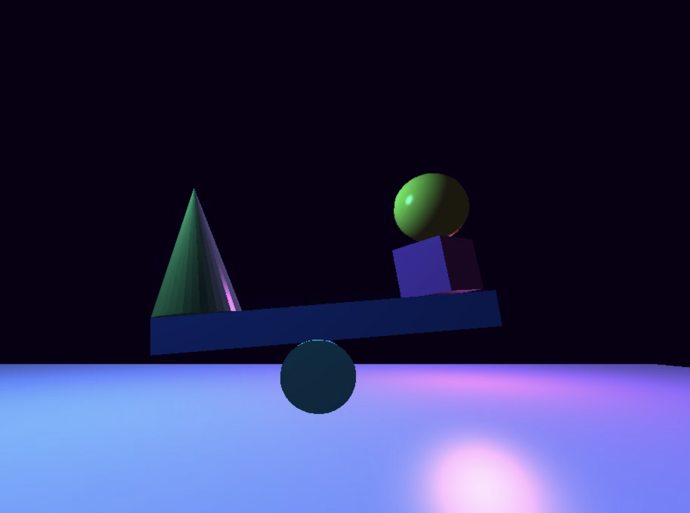

# OpenGL 6-2 Assignment: Cyberpunk Scene

This project restyles the 6-2 OpenGL scene into a cyberpunk visual direction.

## Project Summary
This scene starts from the provided 6-2 assignment setup and applies a custom visual direction:
- Light-purple ground plane
- Distinct neon object colors
- Cyan and magenta lighting contrast
- Deep purple-black background tone

## What Was Built
- A stylized 3D seesaw composition using primitive meshes
- Shader-lit materials with cyberpunk-inspired color tuning
- Camera movement and mouse-look interaction

## Run Instructions
1. Open `6-2_Assignment.sln` in Visual Studio 2022.
2. Set configuration to `Debug` and platform to `Win32`.
3. Press `F5` to build and run.

## Controls
- `W` / `A` / `S` / `D`: Move camera
- `Mouse`: Look around
- `TAB`: Toggle mouse capture
- `ESC`: Close the application

## Requirements
- Windows 10 or Windows 11
- Visual Studio 2022 with Desktop development with C++
- OpenGL-compatible GPU and drivers
